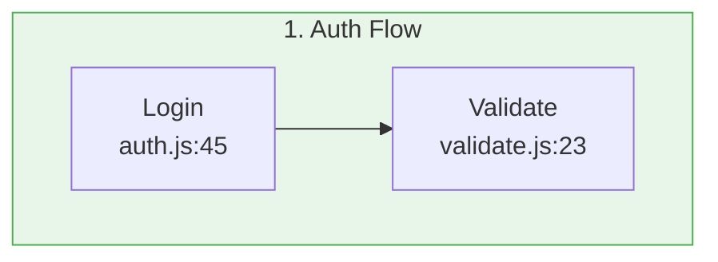

# DeepWiki MCP Server - Architecture Documentation

## Design Philosophy

This MCP server follows **production-grade best practices for 2026**, emphasizing:

1. **Async-First Design** - Non-blocking operations throughout
2. **Resilience** - Comprehensive error handling and retry logic
3. **Observability** - Structured logging and monitoring
4. **Type Safety** - Pydantic models and Python type hints
5. **Resource Management** - Connection pooling and concurrency limits
6. **Developer Experience** - Clear errors, helpful suggestions, rich documentation

## Architecture Overview

```
┌─────────────────────────────────────────────────────────────┐
│                     MCP Client (Claude)                      │
└────────────────────────┬────────────────────────────────────┘
                         │ MCP Protocol
┌────────────────────────▼────────────────────────────────────┐
│                   FastMCP Server Layer                       │
│  • Tool Registration (@mcp.tool decorators)                  │
│  • Request/Response Serialization                            │
│  • Protocol Handling                                         │
└────────────────────────┬────────────────────────────────────┘
                         │
┌────────────────────────▼────────────────────────────────────┐
│                    Business Logic Layer                      │
│  • deepwiki_query()      • deepwiki_search_repos()          │
│  • deepwiki_get_result() • deepwiki_warm_repo()             │
│  • deepwiki_repo_status()                                   │
└────────────────────────┬────────────────────────────────────┘
                         │
┌────────────────────────▼────────────────────────────────────┐
│                   DeepWikiClient Layer                       │
│  • Connection Pooling                                        │
│  • Retry Logic (Tenacity)                                   │
│  • Timeout Management                                        │
│  • Semaphore-based Concurrency Control                      │
└────────────────────────┬────────────────────────────────────┘
                         │
┌────────────────────────▼────────────────────────────────────┐
│                    HTTP Client (httpx)                       │
│  • Async I/O                                                 │
│  • Connection Reuse                                          │
│  • Automatic Retries                                         │
└────────────────────────┬────────────────────────────────────┘
                         │
┌────────────────────────▼────────────────────────────────────┐
│                 DeepWiki API (api.devin.ai)                  │
└─────────────────────────────────────────────────────────────┘
```

## Key Components

### 1. Configuration Layer (`Settings`)

**Purpose:** Centralized configuration management

**Design Decisions:**
- Uses Pydantic Settings for validation and type safety
- Supports `.env` file and environment variables
- All settings prefixed with `DEEPWIKI_` to avoid conflicts
- Sensible defaults for all values

**Example:**
```python
class Settings(BaseSettings):
    deepwiki_api_url: str = "https://api.devin.ai"
    poll_interval_ms: int = 2000
    # ... more settings
```

**Why Pydantic Settings?**
- Type validation at startup
- Automatic environment variable parsing
- Clear error messages for misconfiguration
- IDE autocomplete support

### 2. HTTP Client Layer (`DeepWikiClient`)

**Purpose:** Abstraction over HTTP communication with built-in reliability

**Key Features:**

#### Connection Pooling
```python
self.limits = httpx.Limits(
    max_connections=20,        # Total connections
    max_keepalive_connections=10  # Reusable connections
)
```
- Reuses TCP connections
- Reduces latency
- Limits resource usage

#### Timeout Configuration
```python
self.timeout = httpx.Timeout(
    connect=10.0,   # Connection establishment
    read=180.0,     # Reading response (long for deep mode)
    write=10.0,     # Writing request
    pool=5.0        # Getting connection from pool
)
```
- Prevents indefinite hangs
- Different timeouts for different phases
- Read timeout is generous for deep analysis

#### Retry Logic (Tenacity)
```python
@retry(
    stop=stop_after_attempt(3),
    wait=wait_exponential(multiplier=1, min=2, max=10),
    retry=retry_if_exception_type((httpx.TimeoutException, httpx.NetworkError))
)
```
- Automatic retries for transient failures
- Exponential backoff: 2s, 4s, 8s
- Only retries safe operations
- Logs retry attempts

#### Concurrency Control (Semaphore)
```python
self._semaphore = asyncio.Semaphore(settings.max_concurrent_queries)

async with self._semaphore:
    # Make API call
```
- Limits concurrent API calls
- Prevents overwhelming the API
- Prevents resource exhaustion
- Per-client semaphore

**Why httpx over requests?**
- Native async/await support
- Better connection pooling
- Modern API design
- Active maintenance

### 3. Data Models (Pydantic)

**Purpose:** Type-safe data structures with validation

**Models:**
- `QueryRequest` - API request payload
- `Codemap` - Code flow visualization data
- `CodemapTrace` - Code execution trace
- `CodemapLocation` - Specific code location
- `ProgressUpdate` - Streaming progress

**Benefits:**
- Runtime validation
- IDE autocomplete
- Automatic JSON serialization
- Clear error messages
- Self-documenting code

**Example:**
```python
class CodemapLocation(BaseModel):
    id: str
    line_content: str
    path: str
    line_number: int
    title: str
    description: str
```

### 4. Mermaid Generator (`MermaidGenerator`)

**Purpose:** Convert code flows into visual diagrams

**Algorithm:**
1. Create subgraphs for each trace
2. Add locations as nodes within subgraphs
3. Connect locations sequentially (solid arrows)
4. Connect traces with transitions (dashed arrows)
5. Apply color scheme (8 colors, rotating)

**Design Decisions:**
- Static methods (no state needed)
- Pure functions (deterministic output)
- Color-coded traces for visual distinction
- Compact node labels (filename + line number)

**Output Format:**


### 5. MCP Tools

**Purpose:** Expose functionality to AI assistants

**Tool Design Principles:**
1. **Rich Descriptions** - Help Claude understand when to use each tool
2. **Type Annotations** - Pydantic validation for all parameters
3. **Error Handling** - Return errors as structured data, not exceptions
4. **Progress Updates** - For long operations
5. **Helpful Suggestions** - Guide users to solutions

**Example Tool Signature:**
```python
@mcp.tool()
async def deepwiki_query(
    question: Annotated[str, Field(
        description="Natural language question...",
        min_length=3,
        max_length=2000
    )],
    repos: Annotated[List[str], Field(
        description="List of repositories...",
        min_length=1,
        max_length=5
    )],
    # ... more parameters
) -> Dict[str, Any]:
```

## Error Handling Strategy

### Levels of Error Handling

#### 1. **Network Layer** (httpx + tenacity)
- Automatic retries for timeouts
- Exponential backoff
- Connection pooling recovery

#### 2. **Client Layer** (DeepWikiClient)
- HTTP status code interpretation
- Rate limit handling
- Server error detection
- Timeout management

#### 3. **Tool Layer** (MCP tools)
- User-friendly error messages
- Actionable suggestions
- Structured error returns
- Never throws exceptions to MCP

### Error Response Format

```python
{
    "error": "Human-readable error message",
    "suggestion": "What the user should try",
    "type": "ErrorType",  # Optional
    "retryable": True/False  # Optional
}
```

### Example Error Handling

```python
try:
    result = await client.poll_until_done(query_id)
except ValueError as e:
    return {
        "error": str(e),
        "suggestion": "Try using 'fast' mode or simplifying your query"
    }
```

## Polling Strategy

### Why Polling?

The DeepWiki API uses long-running queries, so we need to:
1. Submit the query
2. Wait for completion
3. Fetch results

### Polling Algorithm

```python
for attempt in range(max_attempts):
    await asyncio.sleep(interval)
    result = await get_query_status(query_id)
    
    if result.state == "done":
        return result
    elif result.state == "failed":
        raise error
    
    # Optional: Send progress update
    if callback:
        await callback(progress_update)
```

### Configuration

- **Interval:** 2 seconds (configurable)
- **Max Attempts:** 120 (4 minutes)
- **Total Timeout:** interval × max_attempts

### Future Enhancement: WebSocket Streaming

The original CLI supported WebSocket streaming:
```javascript
const ws = new WebSocket(wsUrl);
ws.on('message', handleUpdate);
```

This could be added for real-time progress updates:
```python
async for update in stream_query(query_id):
    yield ProgressUpdate(message=update)
```

## Resource Management

### Connection Lifecycle

```python
# Startup
async def __aenter__(self):
    await self.start()  # Create httpx client
    return self

# Shutdown
async def __aexit__(self, ...):
    await self.close()  # Close all connections

# Cleanup hook
@mcp.on_shutdown
async def cleanup():
    await client.close()
```

### Why Context Managers?

- Guaranteed cleanup
- Exception safety
- Clear lifecycle
- RAII pattern

## Performance Optimizations

### 1. **Connection Reuse**
- HTTP/1.1 Keep-Alive
- Connection pool (max 20)
- Keep-alive pool (max 10)

### 2. **Concurrent Requests**
- Semaphore limits (5 concurrent)
- Async/await prevents blocking
- Connection pool shared across requests

### 3. **Smart Retries**
- Exponential backoff reduces server load
- Only retry transient failures
- Max 3 attempts per request

### 4. **Efficient Polling**
- Configurable interval
- Early exit on completion
- Minimal CPU usage (sleep)

## Logging Strategy

### Log Levels

- **DEBUG:** Request/response details, internal state
- **INFO:** Query lifecycle, completions
- **WARNING:** Retries, rate limits
- **ERROR:** Failures, exceptions

### Structured Logging

```python
logger.info(f"Query {query_id} submitted: {question[:50]}...")
logger.warning(f"Retry attempt {attempt} after {wait}s")
logger.error(f"Query failed: {error}", exc_info=True)
```

### What We Log

- ✅ Query submissions
- ✅ Completions with timing
- ✅ Retry attempts
- ✅ Errors with stack traces
- ✅ Client lifecycle
- ❌ Sensitive data
- ❌ Full responses (too large)

## Type Safety

### Type Hints Throughout

```python
async def poll_until_done(
    self,
    query_id: str,
    callback: Optional[callable] = None
) -> Dict[str, Any]:
```

### Pydantic Validation

- Runtime type checking
- Automatic coercion
- Validation errors

### Benefits

- Catch errors at development time
- IDE autocomplete
- Self-documenting code
- Refactoring safety

## Security Considerations

### 1. **API Key Handling**
- Environment variables only
- Never logged
- Optional (if API requires)

### 2. **HTTPS Enforcement**
- All connections over HTTPS
- Certificate validation
- No insecure fallback

### 3. **Resource Limits**
- Max concurrent queries
- Connection limits
- Timeout enforcement

### 4. **Input Validation**
- Pydantic validates all inputs
- Length limits on strings
- List size limits
- Format validation (repo names)

## Testing Strategy

### Unit Tests (Future)
```python
async def test_retry_logic():
    # Mock failing requests
    # Verify exponential backoff
    # Check attempt limits
```

### Integration Tests (Future)
```python
async def test_full_query_flow():
    # Submit real query
    # Poll for results
    # Verify response format
```

### Example Script
- `examples.py` demonstrates all features
- Tests error handling
- Shows concurrent usage
- Validates Mermaid generation

## Future Enhancements

### 1. **WebSocket Streaming**
- Real-time progress updates
- Faster than polling
- Better UX for long queries

### 2. **Response Caching**
- Cache query results
- LRU eviction
- Configurable TTL

### 3. **Metrics & Monitoring**
- Request latency
- Success/failure rates
- Retry statistics
- Query mode distribution

### 4. **Rate Limit Handling**
- Automatic backoff
- Queue requests
- Fair scheduling

### 5. **Batch Queries**
- Submit multiple queries
- Parallel processing
- Combined results

## Comparison with Original CLI

| Feature | Original CLI | MCP Server |
|---------|-------------|------------|
| Language | TypeScript | Python |
| Framework | Commander | FastMCP |
| HTTP Client | fetch | httpx |
| Retries | None | Tenacity |
| Type Safety | TypeScript | Pydantic |
| Logging | None | Structured |
| Config | Env vars | Pydantic Settings |
| Streaming | WebSocket | Polling (WS future) |
| Connection Pool | No | Yes |
| Concurrency Limit | No | Yes |
| Error Handling | Basic | Comprehensive |

## Design Trade-offs

### Polling vs. Streaming
- **Chosen:** Polling
- **Why:** Simpler, more reliable
- **Trade-off:** Slightly slower, more API calls
- **Future:** Add WebSocket support

### httpx vs. requests
- **Chosen:** httpx
- **Why:** Native async support
- **Trade-off:** Less mature
- **Benefit:** Better performance

### FastMCP vs. Raw MCP SDK
- **Chosen:** FastMCP
- **Why:** Simpler, less boilerplate
- **Trade-off:** Less control
- **Benefit:** Faster development

### Retry Logic
- **Chosen:** 3 attempts, exponential backoff
- **Why:** Balance reliability vs. latency
- **Trade-off:** Max 14s delay
- **Benefit:** Handles transient failures

## Conclusion

This MCP server represents **production-grade 2026 best practices**:

✅ Async-first design
✅ Comprehensive error handling
✅ Type safety throughout
✅ Resource management
✅ Observability
✅ Developer experience
✅ Performance optimization
✅ Security considerations

The architecture is:
- **Scalable:** Connection pooling, concurrency limits
- **Reliable:** Retries, timeouts, error handling
- **Maintainable:** Type hints, documentation, logging
- **Extensible:** Clean layers, future-proof design

This is not just a tool—it's a **reference implementation** for building production MCP servers.
