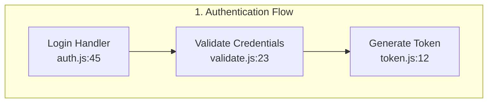

# DeepWiki MCP Server 🚀

A production-grade Model Context Protocol (MCP) server for querying code repositories using DeepWiki AI.

## ✨ Features

- **🔄 Async-First Architecture** - Non-blocking operations for all API calls
- **🔁 Intelligent Retry Logic** - Exponential backoff for transient failures
- **📊 Three Query Modes** - Fast, Deep, and Codemap visualization
- **🎨 Mermaid Diagram Generation** - Visual code flow diagrams
- **🛡️ Comprehensive Error Handling** - Detailed error messages and recovery suggestions
- **📝 Full Type Safety** - Pydantic models throughout
- **🔧 Resource Management** - Connection pooling and semaphore-based concurrency control
- **📈 Logging & Observability** - Structured logging with configurable levels
- **⚙️ Environment Configuration** - Flexible settings via environment variables

## 🎯 What Can You Do?

Ask natural language questions about code repositories:

- "How does authentication work in React?"
- "Show me the data flow for user registration in Next.js"
- "Where is error handling implemented?"
- "Explain the component lifecycle in this framework"
- "Generate a visual diagram of the API request flow"

## 📋 Requirements

- Python 3.9+
- FastMCP
- httpx (async HTTP client)
- Pydantic (data validation)
- tenacity (retry logic)

## 🚀 Installation

1. **Install dependencies:**

```bash
pip install fastmcp httpx pydantic pydantic-settings tenacity
```

2. **Make the script executable:**

```bash
chmod +x deepwiki_mcp.py
```

3. **Optional: Create `.env` file for configuration:**

```bash
cp .env.example .env
# Edit .env with your settings
```

## ⚙️ Configuration

All settings can be configured via environment variables with the `DEEPWIKI_` prefix:

| Variable | Default | Description |
|----------|---------|-------------|
| `DEEPWIKI_API_URL` | `https://api.devin.ai` | DeepWiki API base URL |
| `DEEPWIKI_API_KEY` | `None` | API key (if required) |
| `DEEPWIKI_POLL_INTERVAL_MS` | `2000` | Polling interval in milliseconds |
| `DEEPWIKI_POLL_MAX_ATTEMPTS` | `120` | Max polling attempts before timeout |
| `DEEPWIKI_CONNECT_TIMEOUT` | `10.0` | HTTP connection timeout (seconds) |
| `DEEPWIKI_READ_TIMEOUT` | `180.0` | HTTP read timeout (seconds) |
| `DEEPWIKI_MAX_CONCURRENT_QUERIES` | `5` | Max concurrent queries |
| `DEEPWIKI_LOG_LEVEL` | `INFO` | Logging level |

## 🔧 MCP Integration

### Using with Claude Desktop

Add to your Claude Desktop configuration (`~/Library/Application Support/Claude/claude_desktop_config.json` on macOS):

```json
{
  "mcpServers": {
    "deepwiki": {
      "command": "python",
      "args": ["/path/to/deepwiki_mcp.py"],
      "env": {
        "DEEPWIKI_LOG_LEVEL": "INFO"
      }
    }
  }
}
```

### Using with Claude Code

```bash
claude-code mcp add deepwiki python /path/to/deepwiki_mcp.py
```

## 🛠️ Available Tools

### 1. `deepwiki_query`

Query code repositories with natural language.

**Parameters:**
- `question` (required): Your question about the code
- `repos` (required): List of repositories (e.g., `["facebook/react"]`)
- `mode` (optional): `fast`, `deep`, or `codemap` (default: `fast`)
- `context` (optional): Additional context to guide the search
- `generate_summary` (optional): Generate summary (default: `true`)
- `include_mermaid` (optional): Include Mermaid diagram for codemap mode

**Example:**
```python
{
  "question": "How does authentication work?",
  "repos": ["facebook/react"],
  "mode": "deep"
}
```

### 2. `deepwiki_get_result`

Retrieve results from a previous query.

**Parameters:**
- `query_id` (required): Query ID from previous query
- `include_mermaid` (optional): Include Mermaid diagram if available

### 3. `deepwiki_repo_status`

Check if a repository is indexed and ready.

**Parameters:**
- `repo` (required): Repository name (e.g., `"facebook/react"`)

### 4. `deepwiki_search_repos`

Search for available indexed repositories.

**Parameters:**
- `search` (required): Search term (e.g., `"react"`, `"machine learning"`)

### 5. `deepwiki_warm_repo`

Pre-warm a repository's cache for faster queries.

**Parameters:**
- `repo` (required): Repository name (e.g., `"facebook/react"`)

## 📊 Query Modes Explained

### Fast Mode ⚡
- **Speed:** 2-5 seconds
- **Use for:** Quick lookups, finding specific functions/patterns
- **Best when:** You know roughly what you're looking for

### Deep Mode 🔍
- **Speed:** 30-60 seconds
- **Use for:** Complex architectural questions, thorough analysis
- **Best when:** You need comprehensive understanding

### Codemap Mode 🗺️
- **Speed:** 20-40 seconds
- **Use for:** Understanding code flow and execution paths
- **Best when:** You want visual diagrams of how code connects
- **Bonus:** Set `include_mermaid=true` to get flowchart diagrams

## 🎨 Mermaid Diagrams

When using `codemap` mode with `include_mermaid=true`, you get beautiful flowcharts:



## 🔐 Error Handling

The server provides detailed error messages:

```json
{
  "error": "Request timed out. Try using 'fast' mode or a simpler query.",
  "suggestion": "Break down your query into smaller parts"
}
```

Common scenarios handled:
- ✅ Timeouts → Suggests faster mode
- ✅ Rate limits → Retry with backoff
- ✅ Invalid repos → Format validation
- ✅ Network errors → Automatic retries
- ✅ Server errors → Clear messaging

## 📈 Performance

- **Connection pooling:** Reuses HTTP connections
- **Concurrent limits:** Prevents overwhelming the API
- **Smart retries:** Exponential backoff for transient failures
- **Efficient polling:** Configurable intervals

## 🧪 Example Usage in Claude

**User:** "How does React handle component updates?"

**Claude:** (Calls `deepwiki_query` tool)
```json
{
  "question": "How does React handle component updates?",
  "repos": ["facebook/react"],
  "mode": "deep"
}
```

**Result:** Comprehensive analysis of React's reconciliation algorithm, virtual DOM diffing, and state update mechanisms.

---

**User:** "Show me the authentication flow in Next.js as a diagram"

**Claude:** (Calls `deepwiki_query` tool)
```json
{
  "question": "Show me the authentication flow",
  "repos": ["vercel/next.js"],
  "mode": "codemap",
  "include_mermaid": true
}
```

**Result:** Visual Mermaid diagram showing the complete authentication flow.

## 🐛 Troubleshooting

### "Query timed out"
- Try using `fast` mode instead of `deep`
- Break complex questions into smaller parts
- Increase `DEEPWIKI_READ_TIMEOUT`

### "Rate limit exceeded"
- Wait a few minutes before retrying
- Reduce `DEEPWIKI_MAX_CONCURRENT_QUERIES`

### "Repository not found"
- Use `deepwiki_search_repos` to find available repos
- Check repository name format: `owner/repo`
- Try `deepwiki_warm_repo` to index the repository

### Connection errors
- Check your internet connection
- Verify `DEEPWIKI_API_URL` is correct
- Check if API key is required

## 📝 Logging

Logs include:
- Query submissions and completions
- Retry attempts with backoff times
- Error details with stack traces
- Performance metrics

Set `DEEPWIKI_LOG_LEVEL=DEBUG` for verbose output.

## 🔒 Security

- API keys (if required) are passed via environment variables
- No credentials stored in code
- HTTPS connections enforced
- Connection limits prevent resource exhaustion

## 🎯 Best Practices

1. **Start with Fast mode** - Try `fast` before `deep`
2. **Warm repositories** - Use `deepwiki_warm_repo` for frequently queried repos
3. **Be specific** - Clear questions get better results
4. **Use context** - Add relevant context to guide the search
5. **Check status first** - Use `deepwiki_repo_status` before querying new repos

## 🤝 Contributing

This is a production-grade implementation following 2026 best practices:
- Async-first design
- Comprehensive error handling
- Type safety throughout
- Resource management
- Extensive logging
- Clean architecture

## 📄 License

MIT License - feel free to use and modify!

## 🙏 Acknowledgments

Built with:
- [FastMCP](https://github.com/jlowin/fastmcp) - Simplified MCP server framework
- [httpx](https://www.python-httpx.org/) - Modern async HTTP client
- [Pydantic](https://pydantic-docs.helpmanual.io/) - Data validation
- [tenacity](https://tenacity.readthedocs.io/) - Retry logic

---

**Made with ❤️ for the MCP ecosystem**
